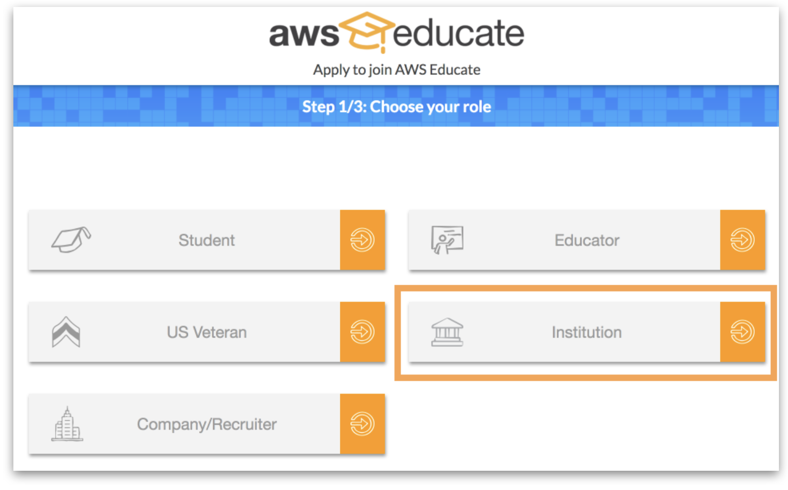
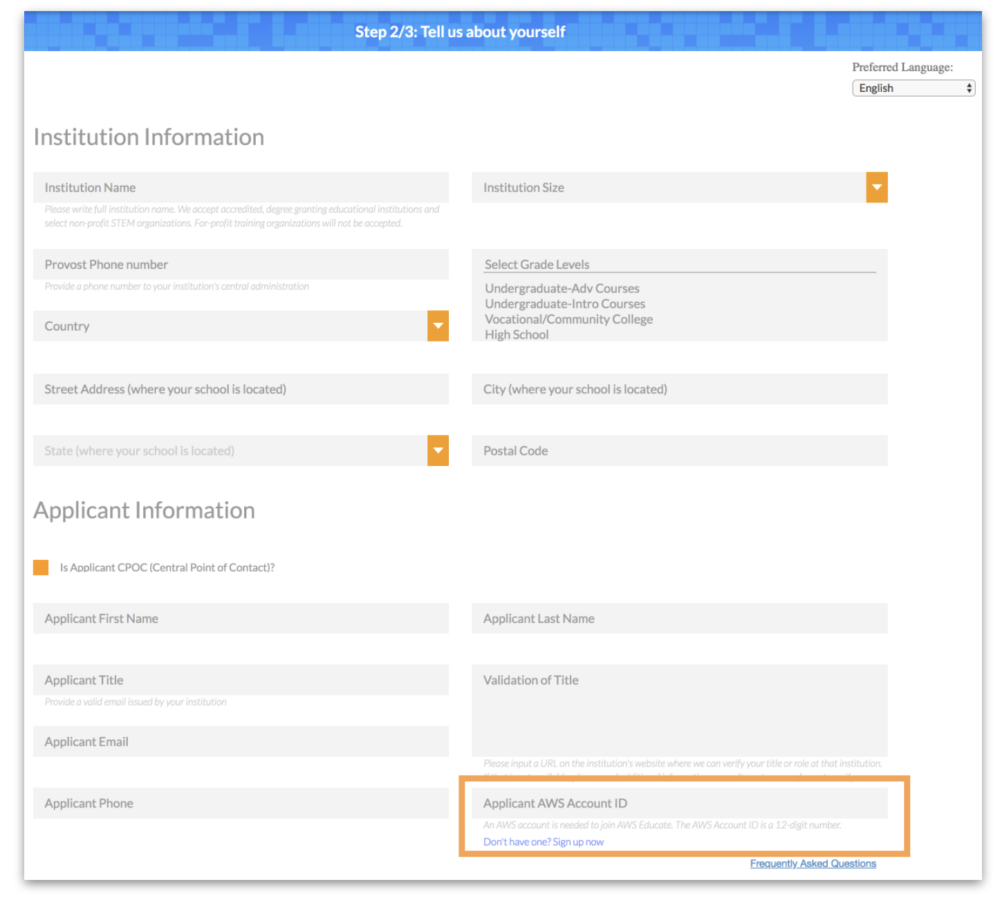
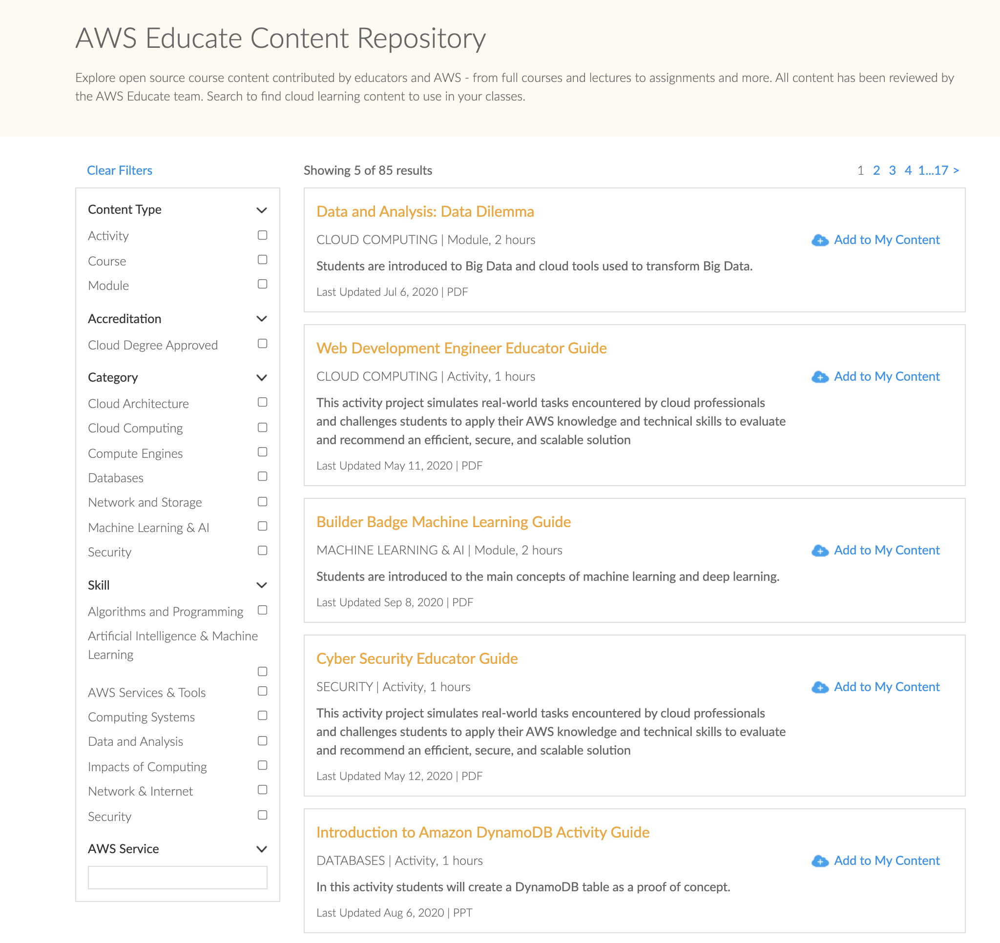
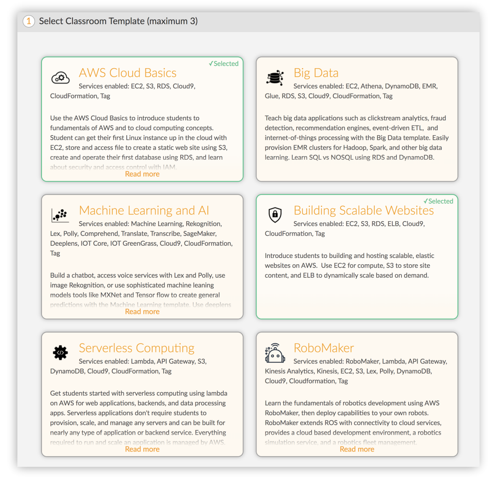
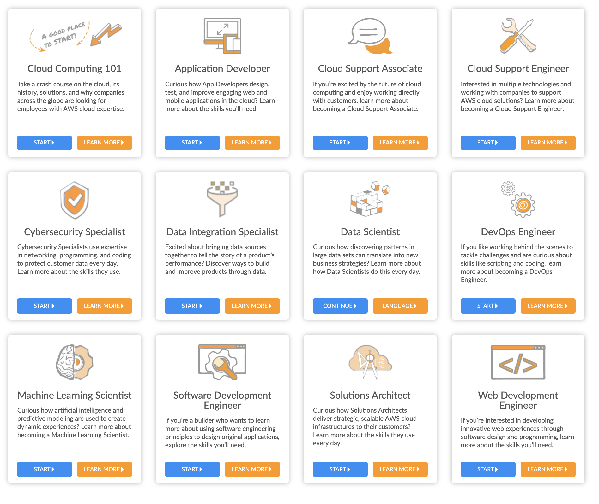
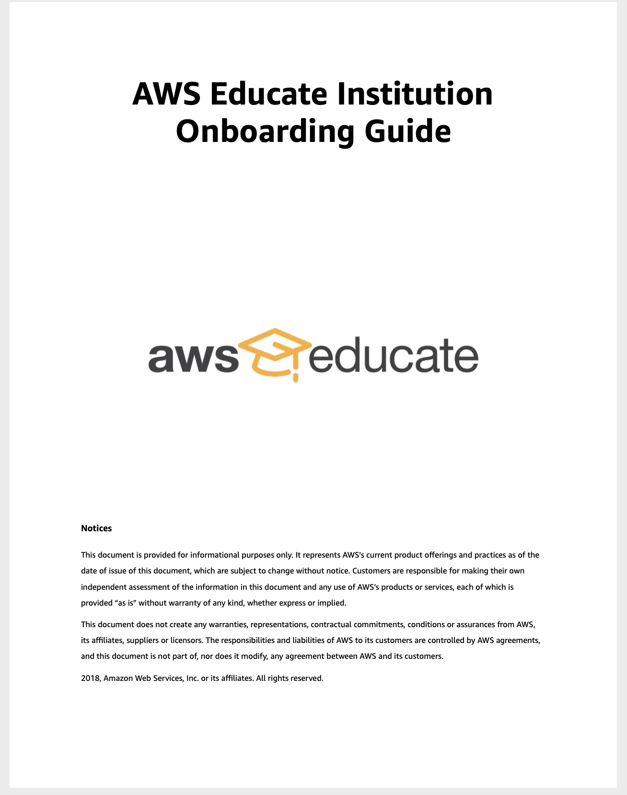
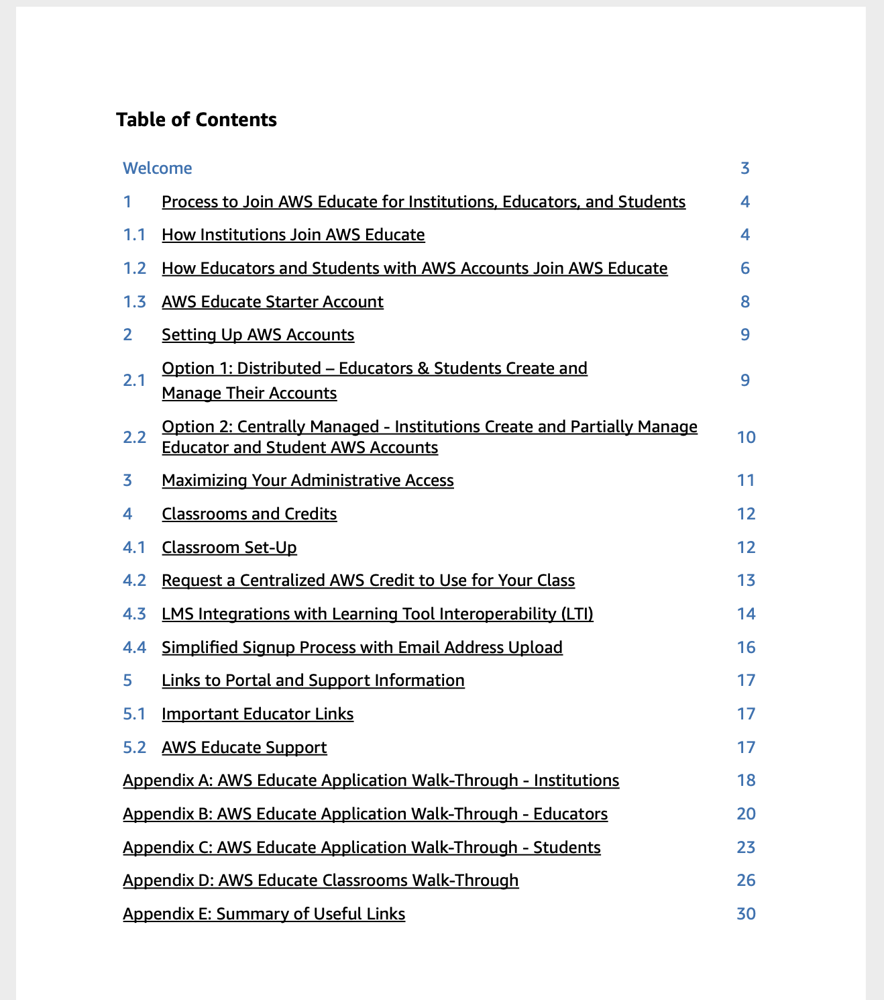

# AWS Educate Platform Highlights

# Managing AWS Educate Accounts

When applying to join AWS Educate, each applicant is asked to either enter an AWS Account ID or create an AWS Educate Starter Account. There are several options to set up an AWS Account that can accommodate different use cases. Depending on your institution’s needs, any of the following options may be useful:
* Option 1: A fully distributed option that enables educators and students to create and manage their own unique AWS Accounts, including Educate Starter Accounts. Benefits:
  * Easiest option for the institution to administer.
  * The institution is not responsible for the educator or student
accounts.
Students can continue to use their account after graduation with no action required from the institution.

* Option 2: A centralized option, where institutions create and partially manage educator and student AWS Accounts. Benefits:
  * Educators and students wouldn’t be required to set up their own accounts.
  * Institutions spread the AWS credits across all of the linked accounts, thereby mitigating overages by individual educators or students.
  * Institutions could terminate running services (as long as root access to linked accounts is retained).

Account Types

* AWS Educate Starter Account: The AWS Educate Starter Account offers free access to a specified amount of AWS cloud resources without requiring a credit card for payment. Usage is capped in order to protect students and educators from any fees. 

## Signup
 

 

# AWS Educate Content Repository
 

 

 

# Educate Guide
 

 
